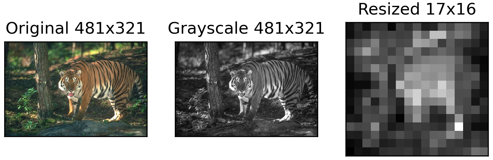

# Near-Duplicate Image Detection

The documentation is a work in progress. In the meantime, please refer to my blog post on [locality-sensitive hashing](https://cemunds.github.io/post/locality-sensitive-hashing/).